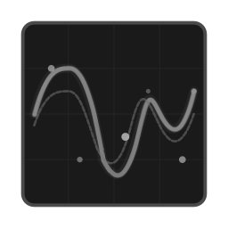
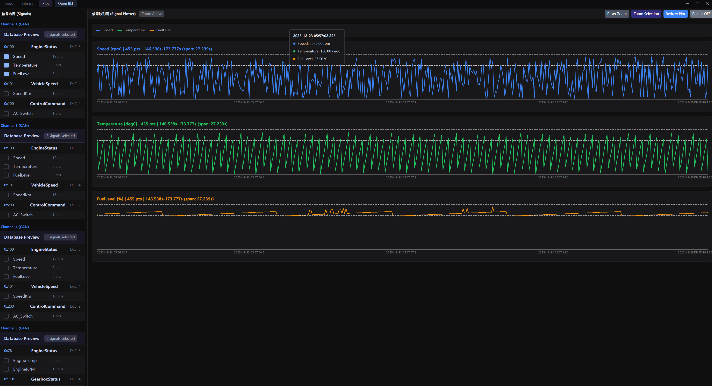

# CANVIEW
<div align="center">



*Oscilloscope-style Logo - Modern CAN/LIN Bus Data Analyzer*
</div>

The software is completely open source; your star is my motivation for development.
**Modern Bus Data Analyzer for CAN, LIN, FlexRay & Ethernet**

[](https://github.com/canview/canview/actions)
[](https://opensource.org/licenses/MIT)
[](https://www.rust-lang.org/)
[](https://github.com/canview/canview/releases)

[English](README.md) | [中文文档](README_zh.md)

</div>

---

## 📖 Table of Contents

- [Features](#-features)
- [Screenshots](#-screenshots)
- [Quick Start](#-quick-start)
- [Installation](#-installation)
- [Usage](#-usage)
- [Project Structure](#-project-structure)
- [Supported Formats](#-supported-formats)
- [Development](#-development)
- [Cross-Compilation](#-cross-compilation)
- [Contributing](#-contributing)
- [License](#-license)

---

## ✨ Features

### 🚀 High-Performance BLF Parser
- **Fast & Efficient**: Built with Rust for zero-cost abstractions and memory safety
- **Comprehensive Support**: CAN, CAN FD, LIN, FlexRay, and Ethernet message types
- **Zero Dependencies**: Minimal external dependencies for easy integration

### 🗄️ Database Parser
- **DBC Support**: Parse Vector DBC files for CAN signal definitions
- **LDF Support**: Parse LIN Description Files (LDF) for LIN signal definitions
- **Multi-Version**: Support multiple database versions simultaneously

### 🖥️ Modern Desktop Application
- **GPU-Accelerated UI**: Built with GPUI for smooth, responsive interface
- **Real-time Decoding**: Decode signals on-the-fly using loaded databases
- **Multi-Channel Support**: Map different channels to specific databases
- **Advanced Filtering**: Filter by ID, channel, or message type
- **Configuration Management**: Organize databases into libraries with version control
- **Flexible Display**: Toggle between hexadecimal and decimal ID display
- **Signal Plotting**: Interactive line charts for signal visualization with zoom and hover support
- **Smart Tooltips**: Real-time signal values, units, and absolute wall-clock time display on chart hover
- **Zoom & Pan**: Draggable zoom range for detailed signal analysis

### 🎨 User Interface
- **Clean & Modern**: Intuitive dark theme interface
- **Custom Scrollbar**: Smooth scrolling with drag support
- **Interactive Filtering**: Click-to-filter on ID and channel columns
- **Responsive Design**: Adapts to different screen sizes
- **Status Bar**: Real-time file statistics and application state

---

## 📸 Screenshots

### Application Icon


*New oscilloscope-style icon design featuring signal waveforms and data points*

### BLF Logs Viewer


### Signal Plotter


---

## 🎨 Logo & Branding

CANVIEW features a modern oscilloscope-style logo representing bus signal analysis:

- **Design**: Oscilloscope screen with waveform patterns and animated data points
- **Theme**: Professional dark theme suitable for technical applications
- **Formats**: Available in SVG (vector), PNG, and Windows ICO formats
- **Sizes**: From 16×16 (favicon) to 512×512 (high-resolution)

For detailed logo usage guidelines, design specifications, and brand assets, see [LOGO_GUIDE.md](LOGO_GUIDE.md).

---

## 🚀 Quick Start

### Prerequisites

- **Rust** 1.70 or later
- **Git**

### Install from Source

```bash
# Clone the repository
git clone https://github.com/your-username/canview.git
cd canview

# Build and run
cargo run --release --bin view
```

### Download Pre-built Binaries

Visit the [Releases](https://github.com/your-username/canview/releases) page to download pre-built binaries for:
- **Windows** (x86_64)
- **macOS** (Apple Silicon & Intel)
- **Linux** (x86_64)

---

## 📦 Installation

### Method 1: Cargo (Recommended for Developers)

```bash
cargo install canview --bin view
```

### Method 2: Build from Source

```bash
# Clone the repository
git clone https://github.com/your-username/canview.git
cd canview

# Build release version
cargo build --release --bin view

# The binary will be at:
# - Windows: target\release\view.exe
# - macOS/Linux: target/release/view
```

### Method 3: Download Release Binaries

1. Go to [Releases](https://github.com/your-username/canview/releases)
2. Download the appropriate binary for your platform
3. Extract and run the executable

### Platform-Specific Notes

#### Windows
- The executable includes a custom icon
- Windows may show a SmartScreen warning on first run (click "More info" → "Run anyway")

#### macOS
- If you get "unidentified developer" warning:
  ```bash
  xattr -cr /path/to/view
  ```
- For .app bundle creation, see [BUILD.md](BUILD.md)

#### Linux
- Ensure X11/Wayland libraries are installed:
  ```bash
  sudo apt-get install libxkbcommon-dev libx11-dev libegl1-mesa-dev
  ```

---

## 🎯 Usage

### Basic Usage

1. **Launch the application**
   ```bash
   # From source
   cargo run --release --bin view

   # From binary
   ./view  # Linux/macOS
   view.exe  # Windows
   ```

2. **Open a BLF file**
   - Click "Open BLF File" button
   - Select your `.blf` or `.bin` file
   - Messages will be displayed in the list view

3. **Load database files (optional)**
   - Click "Config" tab
   - Add DBC (for CAN) or LDF (for LIN) files
   - Map channels to specific databases
   - Switch back to "Log" tab to see decoded signals

### Advanced Features

#### Filtering Messages
- **By ID**: Click on any ID in the list to filter by that ID
- **By Channel**: Click on "CH" column header, then select a channel
- **Clear Filter**: Click the "×" button next to the filter indicator

#### ID Display Mode
- Toggle between hexadecimal (0x123) and decimal (291) display
- Use the "HEX/DEC" button in the toolbar

#### Signal Decoding
1. Load a DBC file in the Config tab
2. Map it to the appropriate CAN channel
3. Signals will be automatically decoded in the message list

#### Configuration Management
- **Signal Libraries**: Organize your DBC/LDF files
- **Version Control**: Switch between different database versions
- **Channel Mapping**: Assign different databases to different channels
- Configuration is automatically saved to `canview_config.json`

---

## 📁 Project Structure
```
canview/
├── src/
│   ├── blf/                    # BLF Parser Library
│   │   ├── src/
│   │   │   ├── objects/        # BLF object implementations
│   │   │   │   ├── can/        # CAN message objects
│   │   │   │   ├── lin/        # LIN message objects
│   │   │   │   ├── flexray/    # FlexRay objects
│   │   │   │   └── ethernet/   # Ethernet objects
│   │   │   ├── parser.rs       # Main BLF parser
│   │   │   └── lib.rs          # Library exports
│   │   └── Cargo.toml
│   │
│   ├── parser/                 # Database Parser Library
│   │   ├── src/
│   │   │   ├── dbc/            # DBC parsing logic
│   │   │   ├── ldf/            # LDF parsing logic
│   │   │   └── lib.rs
│   │   └── Cargo.toml
│   │
│   └── view/                   # Desktop Application
│       ├── src/
│       │   └── main.rs         # Application entry point
│       ├── build.rs            # Resource script (Windows icon)
│       └── Cargo.toml
│
├── assets/                     # Application assets
│   ├── svg/                    # Vector logos (multiple sizes)
│   │   ├── logo.svg            # Main oscilloscope-style logo
│   │   ├── logo-16x16.svg      # 16x16 pixels
│   │   ├── logo-32x32.svg      # 32x32 pixels
│   │   └── ...                 # Up to 512x512
│   ├── ico/                    # Windows icons
│   │   └── canview.ico         # Compiled icon with all sizes
│   ├── png/                    # PNG versions
│   │   ├── logo_16.png         # 16x16 pixels
│   │   └── ...                 # Up to 512x512
│   ├── draw_logo.py            # Logo generation script
│   └── *.svg                   # Other logo source files
│
├── .github/
│   └── workflows/
│       └── build.yml           # CI/CD pipeline
│
├── build.rs                    # Root build script
├── Cargo.toml                  # Workspace configuration
├── BUILD.md                    # Build instructions
├── README.md                   # This file
└── LICENSE                     # MIT License
```

---

## 📋 Supported Formats

### Log File Formats
- **BLF** (Binary Logging Format) - Vector's binary format
- **BIN** - Raw binary log files

### Database Formats
- **DBC** (Database CAN) - Vector CAN database format
- **LDF** (LIN Description File) - LIN database format

### Message Types

#### CAN Bus
- `CanMessage` - Classic CAN message
- `CanMessage2` - Extended CAN message
- `CanFdMessage` - CAN FD message
- `CanFdMessage64` - CAN FD with 64-byte data

#### LIN Bus
- `LinMessage` - Classic LIN message
- `LinMessage2` - Extended LIN message

#### FlexRay
- FlexRay messages and status events

#### Ethernet
- Ethernet frames

#### System Events
- App triggers
- Comment markers
- Global markers
- Statistics and error information

---

## 🛠️ Development

### Setting Up Development Environment

```bash
# Clone the repository
git clone https://github.com/your-username/canview.git
cd canview

# Install development dependencies
cargo install cargo-edit

# Run tests
cargo test --workspace

# Run with logging
RUST_LOG=debug cargo run --bin view

# Format code
cargo fmt --all

# Run clippy
cargo clippy --all-targets --all-features
```

### Using as a Library

#### BLF Parser

```toml
[dependencies]
blf = { git = "https://github.com/your-username/canview.git", branch = "main" }
```

```rust
use blf::{read_blf_from_file, LogObject};

fn main() -> Result<(), Box<dyn std::error::Error>> {
    let result = read_blf_from_file("example.blf")?;

    for object in result.objects {
        match object {
            LogObject::CanMessage(msg) => {
                println!("CAN: ID={:x}, Data={:?}", msg.id, msg.data);
            }
            _ => {}
        }
    }

    Ok(())
}
```

#### Database Parser

```toml
[dependencies]
parser = { git = "https://github.com/your-username/canview.git", branch = "main" }
```

```rust
use parser::dbc::{DbcParser, DbcDatabase};

fn main() -> Result<(), Box<dyn std::error::Error>> {
    let db = DbcParser::parse_file("example.dbc")?;

    for message in &db.messages {
        println!("Message: {} (ID={:x})", message.name, message.id);
    }

    Ok(())
}
```

---

## 🌍 Cross-Compilation

CANVIEW supports cross-compilation for multiple platforms. For detailed instructions, see [BUILD.md](BUILD.md).

### Quick Reference

#### GitHub Actions (Recommended)
Push to GitHub to automatically build all platforms:
```bash
git push origin main
```

#### Manual Cross-Compilation

```bash
# macOS ARM (from macOS)
cargo build --release --target aarch64-apple-darwin

# macOS Universal (from macOS)
lipo -create \
  target/aarch64-apple-darwin/release/view \
  target/x86_64-apple-darwin/release/view \
  -output target/view-universal

# Linux (from Linux)
cargo build --release --target x86_64-unknown-linux-gnu

# Using cargo-zigbuild (any platform)
cargo install cargo-zigbuild
cargo zigbuild --release --target aarch64-apple-darwin
```

---

## 🤝 Contributing

Contributions are welcome! Please follow these steps:

1. Fork the repository
2. Create a feature branch (`git checkout -b feature/amazing-feature`)
3. Commit your changes (`git commit -m 'Add amazing feature'`)
4. Push to the branch (`git push origin feature/amazing-feature`)
5. Open a Pull Request

### Development Guidelines
- Follow Rust style guidelines (`cargo fmt`)
- Pass clippy checks (`cargo clippy`)
- Add tests for new features
- Update documentation as needed

---

## 📊 Project Status

- [x] BLF parser core functionality
- [x] DBC/LDF database parser
- [x] Basic UI with GPUI
- [x] Message filtering
- [x] Signal decoding
- [x] Configuration management
- [x] Cross-platform builds
- [x] Signal charting/plots (Zoom, Hover, Absolute Time)
- [ ] Real-time streaming mode (In Progress)
- [ ] Export to CSV/JSON
- [ ] Search functionality
- [ ] Message bookmarks
- [ ] Statistics dashboard

See [PROJECT_STATUS.md](PROJECT_STATUS.md) for detailed roadmap.

---

## 📜 License

This project is licensed under the MIT License - see the [LICENSE](LICENSE) file for details.

---

## 🙏 Acknowledgments

- **Vector Informatik** - For the BLF format specification
- **Zed Editor** - For the amazing GPUI framework
- **The Rust Community** - For excellent crates and tools

---

## 📞 Support & Feedback

- **Issues**: [GitHub Issues](https://github.com/ucanme/canview/issues)
- **Discussions**: [GitHub Discussions](https://github.com/ucanme/canview/discussions)
- **Email**: admin@ucan,me

---

## 🗺️ Roadmap

### Version 0.2.0 (Planned)
- [x] Signal plotting and charting
- [ ] Real-time data streaming
- [ ] Enhanced search functionality
- [ ] Message bookmarks and annotations

### Version 0.3.0 (Planned)
- [ ] Export to multiple formats (CSV, JSON, Excel)
- [ ] Statistics and analytics dashboard
- [ ] Custom themes support
- [ ] Plugin system

---

<div align="center">

**Built with ❤️ in Rust**

[⬆ Back to Top](#canview)

</div>
