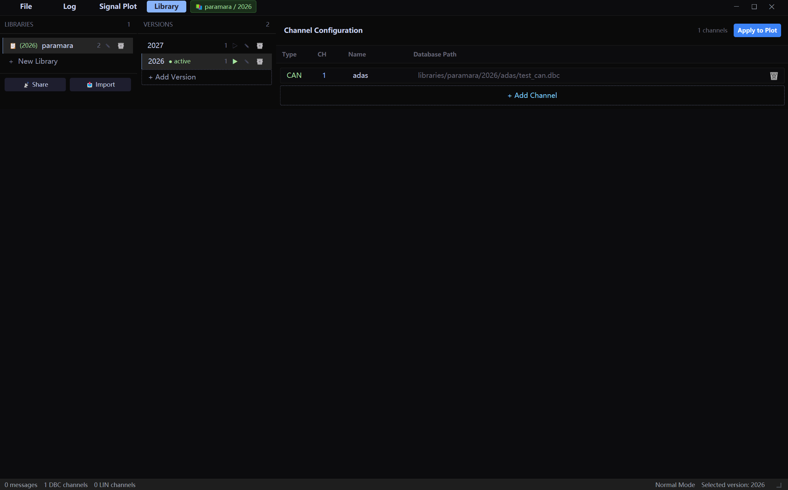

<div align="center">

# CANVIEW


**Open-source cross-platform CAN/LIN bus data analysis tool**

[](https://github.com/ucanme/canview/actions)
[](LICENSE.txt)
[](https://www.rust-lang.org/)
[](https://github.com/ucanme/canview/releases)

Fully open source — your ⭐ keeps development going!

[English](README.md) | [中文文档](README_zh.md)

</div>

---

## Overview

CANVIEW is a high-performance automotive bus analysis tool built in Rust. It integrates BLF log parsing, DBC/LDF signal library management, and a [GPUI](https://gpui.rs/)-powered GPU-accelerated desktop UI.

- 🚀 **Rust native** — zero-copy parsing, fast startup
- 🖥️ **GPU-accelerated UI** — built on GPUI, smooth rendering
- 📊 **Interactive waveform plot** — zoom, pan, hover to inspect
- 📚 **Signal library management** — multi-version DBC/LDF libraries, one-click activation, auto-load
- 🔌 **Multi-bus support** — CAN / CAN FD / LIN / FlexRay / Ethernet
- 🌐 **Cross-platform** — Windows, macOS, Linux

---

## Screenshots

| Log Viewer | Signal Plot |
|:---:|:---:|
|  |  |

| Signal Library Management |
|:---:|
|  |

---

## Quick Start

**Requirements:** Rust nightly, Git

```bash
# Linux additional dependencies
sudo apt-get install libxkbcommon-dev libx11-dev libegl1-mesa-dev

# Build and run
git clone https://github.com/ucanme/canview.git
cd canview
cargo run --release --bin view
```

Pre-built binaries: [Releases](https://github.com/ucanme/canview/releases) (Windows / macOS / Linux)

---

## Usage

1. **Open log** — click File, select a `.blf` file
2. **Manage signal libraries** — switch to the Library tab, add DBC/LDF files, activate a version
3. **Browse log** — switch to the Log tab to view decoded signal values
4. **Plot waveforms** — switch to Signal Plot, select signals; supports zoom and hover

Configuration is auto-saved to `multi_channel_config.json`.

---

## Roadmap

- [x] BLF parsing core
- [x] DBC/LDF database parsing
- [x] GPUI desktop UI
- [x] Message filtering and signal decoding
- [x] Signal waveform plot (zoom, hover, absolute time)
- [x] Multi-version signal library management (create / activate / share)
- [ ] Live streaming mode
- [ ] Export CSV / JSON
- [ ] Diagnostic rule DSL

---

## Development

```bash
cargo test --workspace   # Run tests
cargo fmt --all          # Format
cargo clippy --workspace # Lint
```

For cross-platform builds, see [BUILD.md](BUILD.md).

---

## Contributing

Fork and submit a Pull Request. Please ensure your code passes `cargo fmt` and `cargo clippy`.

---

## License

[MIT License](LICENSE.txt) © 2026 CANVIEW

---

<div align="center">

**Built with ❤️ in Rust**

[Issues](https://github.com/ucanme/canview/issues) · [Discussions](https://github.com/ucanme/canview/discussions) · admin@ucan.me

</div>
