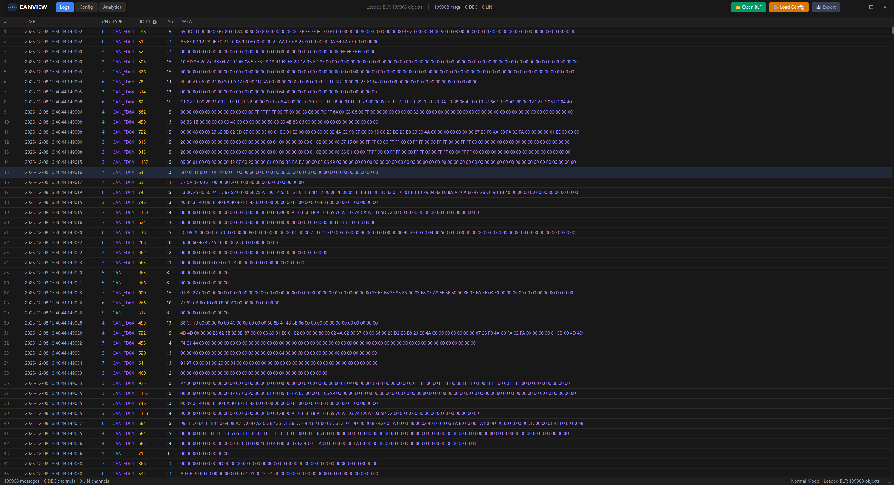

# CanView: BLF 解析库与可视化工具

[English Version](README_en.md)

## 简介

CanView 是一个高性能的 BLF (Binary Logging Format) 工具集，包含：
1. **BLF 解析库** (`blf`): 用于解析 Vector Informatik 的 BLF 文件格式。
2. **数据库解析库** (`parser`): 用于解析 DBC (CAN) 和 LDF (LIN) 数据库文件。
3. **可视化工具** (`view`): 基于 GPUI 开发的现代化桌面应用，用于查看 CAN/LIN 等总线数据。

BLF 是一种广泛应用于汽车工业中的二进制日志文件格式，用于存储 CAN、LIN、FlexRay 和 Ethernet 等总线通信数据。

## 截图

### BLF 日志查看器


## 功能特性

### BLF 解析库 (`blf`)
- **完整的 BLF 格式支持**：支持解析多种类型的日志对象，包括 CAN、CAN FD、LIN、FlexRay、Ethernet 等总线消息
- **高性能**：使用 Rust 的零成本抽象和内存安全特性，实现高性能解析
- **内存安全**：利用 Rust 的所有权和借用检查机制，避免内存泄漏和缓冲区溢出

### 数据库解析库 (`parser`)
- **DBC 支持**：解析 Vector DBC 文件，获取 CAN 信号定义和注释
- **LDF 支持**：解析 LIN 描述文件 (LDF)，获取 LIN 信号定义
- **注释解析**：从数据库文件中提取注释和描述信息，提供更好的上下文

### 桌面可视化工具 (`view`)
- **现代化 UI**：基于 GPUI 框架开发，GPU 加速，提供流畅的用户体验
- **日志可视化**：清晰的消息列表视图，显示时间戳、通道、ID 和数据负载
- **多通道解码**：
    - 为不同通道 (CAN/LIN) 映射特定的 DBC 或 LDF 文件
    - 支持在不同通道上同时激活多个数据库
- **信号解码**：基于加载的数据库实时解码 CAN 和 LIN 信号
- **高级过滤**：
    - 通过点击界面按消息 ID 过滤
    - 按通道过滤
    - 在十六进制和十进制 ID 显示之间切换
- **配置管理**：
    - **信号库**：将 DBC/LDF 文件组织到带有版本控制的库中
    - **活动版本**：即时切换不同的解码配置
    - **JSON 配置**：保存和加载通道映射和库配置
- **自定义滚动条**：为大型日志文件提供流畅的滚动和拖动支持
- **交互式界面**：点击 ID 和通道列进行过滤

## 快速开始

### 运行可视化工具

确保你已经安装了 Rust 环境。

```bash
# 运行桌面查看器
cargo run -p view
```

### 在项目中使用解析库

在你的 `Cargo.toml` 文件中添加依赖：

```toml
[dependencies]
blf = { path = "src/blf" }
parser = { path = "src/parser" }
```

### 使用示例 (解析库)

```rust
use blf::{read_blf_from_file, LogObject};

fn main() -> Result<(), Box<dyn std::error::Error>> {
    // 读取 BLF 文件
    let result = read_blf_from_file("example.blf")?;

    // 遍历解析出的对象
    for object in result.objects {
        match object {
            LogObject::CanMessage(msg) => {
                println!("CAN Message: ID={:x}, DLC={}, Data={:?}",
                         msg.id, msg.dlc, msg.data);
            }
            LogObject::CanFdMessage(msg) => {
                println!("CAN FD Message: ID={:x}, Len={}, Data={:?}",
                         msg.id, msg.valid_payload_length, msg.data);
            }
            LogObject::LinMessage(msg) => {
                println!("LIN Message: ID={:x}, DLC={}, Data={:?}",
                         msg.id, msg.dlc, msg.data);
            }
            _ => {}
        }
    }

    Ok(())
}
```

## 项目结构

```
canview/
├── src/
│   ├── blf/           # BLF 解析库核心代码
│   │   ├── src/
│   │   │   ├── objects/      # 各种对象类型的实现
│   │   │   │   ├── can/      # CAN 消息对象
│   │   │   │   ├── lin/      # LIN 消息对象
│   │   │   │   ├── flexray/  # FlexRay 对象
│   │   │   │   └── ethernet/ # Ethernet 对象
│   │   │   ├── parser.rs     # 主解析器实现
│   │   │   └── lib.rs        # 库导出
│   │   └── Cargo.toml
│   │
│   ├── parser/        # 数据库解析库
│   │   ├── src/
│   │   │   ├── dbc/          # DBC 解析逻辑
│   │   │   ├── ldf/          # LDF 解析逻辑
│   │   │   └── lib.rs
│   │   └── Cargo.toml
│   │
│   └── view/          # 桌面可视化应用
│       ├── src/
│       │   └── main.rs       # UI 逻辑与渲染
│       ├── build.rs          # 资源脚本 (Windows 图标)
│       └── Cargo.toml
│
├── assets/             # 应用资源
│   ├── ico/            # Windows 图标
│   ├── png/            # PNG 图标
│   └── *.svg           # Logo 源文件
│
├── .github/
│   └── workflows/
│       └── build.yml   # CI/CD 流水线
│
├── Cargo.toml          # 工作空间配置
├── README.md           # 项目文档
└── LICENSE             # MIT 许可证
```

## 支持的消息类型

- **CAN**: CanMessage, CanMessage2, CanFdMessage, CanFdMessage64
- **CAN 错误与统计**: CanErrorFrame, CanDriverError, CanDriverStatistic
- **LIN**: LinMessage, LinMessage2 等
- **FlexRay**: 消息、状态、周期事件
- **Ethernet**: Ethernet 帧
- **系统事件**: 应用触发器、注释
- **应用触发器和事件注释**

## 跨平台支持

CanView 通过 GitHub Actions 自动构建支持多个平台：

- ✅ **Windows** (x86_64)
- ✅ **macOS** (Apple Silicon 和 Intel)
- ✅ **Linux** (x86_64)

详细的构建说明请参阅 [BUILD.md](BUILD.md)。

## 许可证

本项目采用 MIT 许可证 - 详见 [LICENSE](LICENSE) 文件。