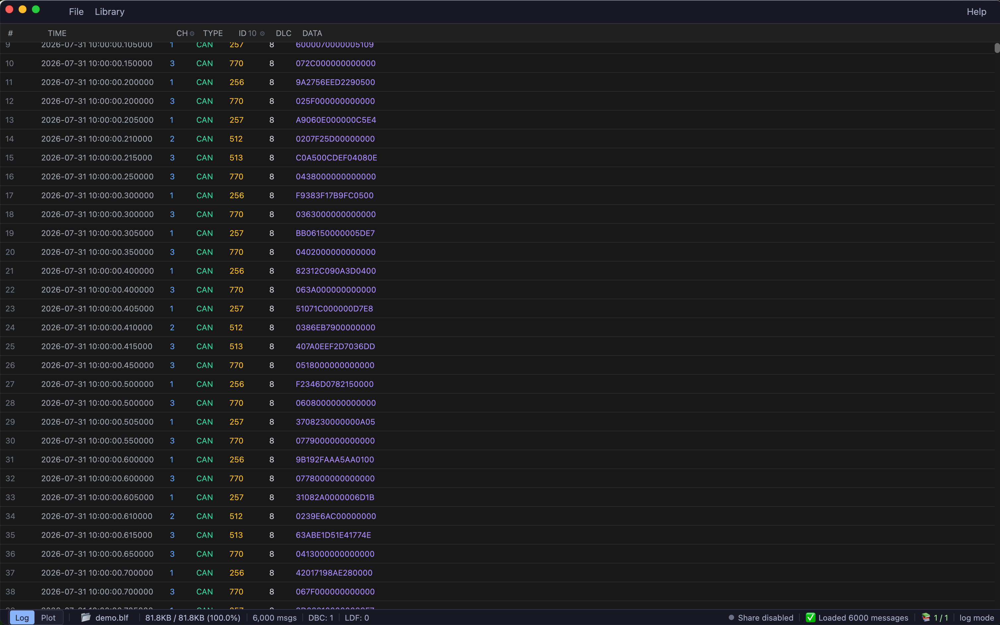
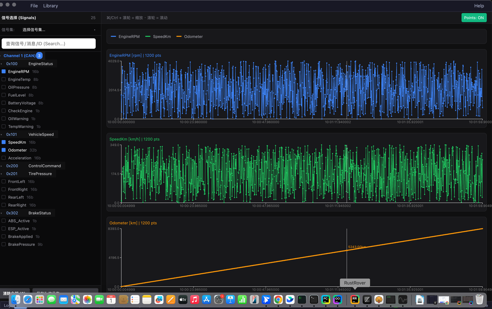

# can-viewer

**开源跨平台 CAN/LIN 总线数据分析工具**

完全开源，你的 ⭐ 是我持续开发的动力！

[English](README.md) | [中文文档](README_zh.md)

---

## 简介

`can-viewer` 是用 Rust 构建的高性能汽车总线数据分析工具。能解析 Vector BLF 日志文件、对照 DBC / LDF 数据库解码信号、并在基于 [GPUI](https://gpui.rs/) 的 GPU 加速界面中绘制交互式波形图。适合需要快速查看大量录制数据、不想被传统 Java 工具拖慢的工程师。

典型工作流：把 `.blf` 录制文件拖到窗口上，为对应通道激活一个 DBC 数据库，浏览解码后的日志，然后选中信号绘制波形按时间扫一遍。多个录制可以同时加载，按全局时间线合并显示。

---

## 功能

**性能**
- 🚀 **Rust 原生** — 零拷贝解析，启动快
- ⚡ **并行 BLF 加载** — 通过 rayon 跨核 zlib 解压;9 MB / 86 万对象文件 warm 加载 ~280ms
- 🖥️ **GPU 加速 UI** — 基于 GPUI，几十万行也能流畅渲染

**总线与数据库**
- 🔌 **多总线支持** — CAN / CAN FD / LIN / FlexRay / Ethernet
- 📚 **多版本信号库** — 每个通道可保留多个 DBC / LDF 版本；一键激活，启动自动加载
- 🎯 **信号集** — 在某个信号库上把"通道+消息+信号"组合保存为命名集合，批量应用到波形侧栏，跨录制快速回放同一组信号

**日志查看**
- 📊 **交互式波形图** — 缩放、平移、悬停查看、选中信号实时绘图、日志中无数据的信号显示占位卡
- 🔍 **ID / 通道过滤** — 按消息 ID 或总线通道筛选日志视图
- ⚠️ **解析错误提示** — 解析失败在状态栏显示 ⚠️ 警告;Loaded Files 浮框列出每个文件的 ❌ 错误详情

**多文件与交互**
- 📁 **按真实时间合并** — 并行加载多个 BLF,消息按绝对时间戳(`measurement_start_time + object_time_stamp`)全局排序,不同会话录制的文件能正确对齐
- 🖱️ **拖拽加载** — 把 `.blf` 文件或文件夹直接拖到窗口;macOS 上拖到 Dock 图标也可;> 1 GB 大文件弹确认对话框
- 🔗 **局域网共享** — 通过 HTTP 在局域网内共享信号库,接收端一键导入
- 🌐 **跨平台** — Windows、macOS、Linux

---

## 截图

| 日志浏览 | 信号绘图 |
|:---:|:---:|
|  |  |

| 信号库管理 |
|:---:|
|  |

---

## 快速开始

**环境要求：** Rust stable（1.85+ 支持 edition 2024）、Git

\`\`\`bash
# Linux 额外依赖
sudo apt-get install libxkbcommon-dev libx11-dev libegl1-mesa-dev

# 构建运行
git clone https://github.com/cantool/can-viewer.git
cd can-viewer
cargo run --release --bin viewer
\`\`\`

预编译包：[Releases](https://github.com/cantool/can-viewer/releases)（Windows / macOS / Linux）

### 用 demo 数据试试

仓库根目录自带一个小演示数据库和匹配的 BLF：

- `demo.dbc` — 6 个 message（EngineStatus、VehicleSpeed、ControlCommand、TirePressure、BrakeStatus），覆盖多种信号类型
- `demo.blf` — 2 分钟 / 6000 条 CAN 报文，120 个 zlib 压缩 LogContainer;ID 与 `demo.dbc` 对应

把 `demo.blf` 拖到窗口，在通道 1 激活 `demo.dbc`，切到 Signal Plot 即可看到解码后的信号。

---

## 使用

1. **打开日志** — File → Open BLF…(单文件，替换当前)或 Open Multiple BLF…(追加)。也支持**直接拖拽** `.blf` 到窗口 — 拖拽会清空当前会话再加载。macOS 上拖到 Dock 图标同样可用。
2. **管理信号库** — Library 标签页 → 添加 DBC / LDF 文件 → 为通道激活某个版本。
3. **信号集** — 在某个信号库上把当前"通道+消息+信号"勾选保存为命名集合。从波形侧栏顶部下拉可批量应用(一次勾选整组)、重命名或删除。
4. **浏览日志** — Log 标签页显示每帧的解码信号值。
5. **绘制波形** — Signal Plot 标签页 → 展开通道/消息 → 选中信号。支持缩放、悬停、绝对时间。
6. **管理已加载文件** — 当加载 ≥ 2 个文件(或任意文件有解析错误)时,点击左下角状态栏的 **📂 N files** 段打开 Loaded Files 浮框。每行 ✕ 可单独移除,或 **Remove All** 全部清空。

拖拽规则:仅接受 `.blf`(`.bin` 需通过 File 菜单);文件夹展开一层;总大小 > 1 GB 弹确认;加载中再拖新文件会取消当前加载并排队新文件。

配置自动保存至二进制旁边的 `multi_channel_config.json`。

📖 **完整使用文档：** [docs/USAGE_zh.md](docs/USAGE_zh.md) — 窗口布局、日志/波形视图、信号库管理、信号集、局域网共享、键盘快捷键、故障排查。

---

## 路线图

### 已完成

- ✅ BLF 解析核心（CAN / CAN FD / LIN / FlexRay / Ethernet）
- ✅ DBC / LDF 数据库解析
- ✅ GPUI 桌面 UI（GPU 加速,跨平台）
- ✅ 消息过滤（按 ID 和通道）与信号解码
- ✅ 信号波形图 — 缩放、悬停、绝对时间、选中信号实时绘图、无数据占位
- ✅ 多版本信号库管理（创建/激活/局域网共享/一键导入）
- ✅ 信号集 — 命名的"通道+消息+信号"组合,批量应用到波形
- ✅ 多文件加载按时间合并（Open BLF... 替换，Open Multiple BLF... 追加）
- ✅ 拖拽加载 BLF（窗口内 + macOS Dock 图标）,文件夹展开,大文件守卫
- ✅ 状态栏多文件段 + ⚠️ 解析错误提示 + Loaded Files 浮框
- ✅ 并行 BLF 加载（rayon 跨核 zlib 解压 + 索引排序合并,多核 CPU 上 ~3× 提速）

### 计划中

- ⬜ 实时流模式（socketcan / 虚拟总线）
- ⬜ 导出 CSV / JSON
- ⬜ 诊断规则 DSL（自定义告警/错误条件）
- ⬜ 根据观测流量生成 DBC
- ⬜ 回放 / 重发（把消息发回总线）

---

## 开发

\`\`\`bash
cargo test --workspace   # 运行测试
cargo fmt --all          # 格式化
cargo clippy --workspace # 静态检查
\`\`\`

跨平台构建和打包脚本详见 [`scripts/`](scripts/) 和 [构建工作流](.github/workflows/build.yml)。

---

## 贡献

欢迎 Fork 并提交 Pull Request。请确保代码通过 `cargo fmt` 和 `cargo clippy` 检查。

---

## 许可证

[MIT License](LICENSE.txt) © 2026 can-viewer

---

**使用 Rust 用 ❤️ 构建**

[Issues](https://github.com/cantool/can-viewer/issues) · [Discussions](https://github.com/cantool/can-viewer/discussions) · admin@ucan.me

